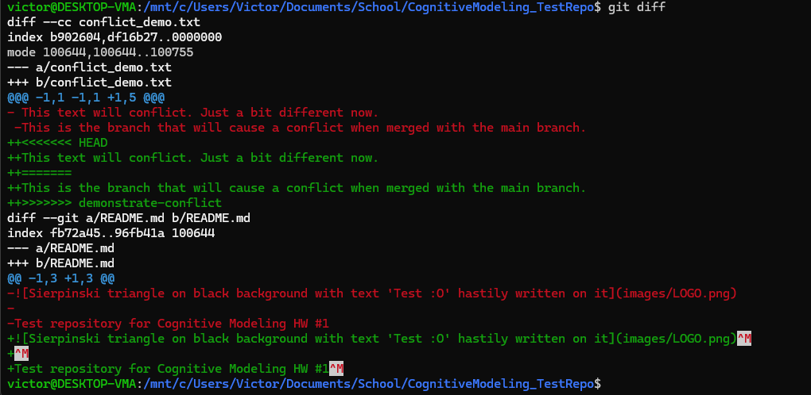

# Test repository for Cognitive Modeling HW #1

## Ben Wertz & Victor Angielczyk


## Problem 1: True-False Questions

1. Stochastic models will always produce the same output x given the same input parameters $\theta$.
    - **FALSE** (need to include random parameters $\xi$)
2. In psychology, replicability refers to obtaining consistent results using the same data and analysis methods, while reproducibility refers to obtaining consistent results by conducting a new study with different data under similar conditions.
    - **FALSE** (it’s the other away around)
3. In Python, the expression `5 + "5"` will result in a TypeError.
    - **TRUE**
4. The `git rebase` command is used to squash commits in the history, but it cannot be used to reapply commits on top of a different base branch.
    - **FALSE** (reapplying commits on top of a different base branch is what `git rebase` does)
5. A detached HEAD state in Git means you are no longer on any branch and cannot commit changes until you switch back to a branch.
    - **FALSE** (you can still commit, but you’re not on a branch)
6. Function arguments in Python are passed by reference, meaning that modifying a mutable object within a function will also modify it outside the function scope.
    - **FALSE** (Python passes object references; mutating works)
7. Using the `is` operator in Python checks for value equality, similar to the `==` operator.
    - **FALSE** (`is` checks for reference equality, `==` checks for value equality)
8. The `.gitignore` file in a Git repository is used to specify files that should not be tracked by Git and cannot be overridden by a user.
    - **FALSE** (`.gitignore` is overridable by the user)

## Problem 2: Inverse vs. Forward Problems

### Inverse problems
- Inverse kinematics in robotics (for example, finding the joint parameters to move the end effector of a robot arm to a desired position/orientation) 
    - (harder: usually needs searching/iteration, and there can be multiple solutions).
- Inferring the transmission rates, average recovery times, etc. for an epidemic given observations of susceptible, infected, exposed, recovered, etc. people over time
    - (harder: you keep re-running the model while tweaking parameters to match data. An Bayesian MCMC process might be used to infer the model parameters, but in practice this could become very complicated).
- Sentiment analysis (predicting a person’s emotional state from eg. a product review)
    - (medium: fast once the model is trained, but training can take a lot of compute and data).

### Forward problems
- Modeling infected population over time given a set of initial conditions (SEIR from lecture).
    - (easier: just run the equations of the SEIR model forward in time numerically).
- Projectile motion / trajectory prediction (given initial position/velocity and gravity, predict where the object will be over time)
    - (easier: direct computation, usually no more complex than solving a system of ODEs using finite-difference methods).
- Heat diffusion / temperature spread (given an initial temperature and material properties, predict temperature over time)
    - (medium: Requires numerically solving a PDE (the heat equation), and finite-element methods used to simulate heat transfer in irregularly-shaped objects can get pretty complicated. Some scenarios will require an implicit methods which require multiple iterations to converge or require inverting large matrices which is inefficient).

## Problem 3: Git and GitHub

### Part 1
Cogntiive modeling is critical to modern psychology and cog. science research because developing new theories in these fields is fundamentally difficult. Trying to understand the 'true' explanations for human behavior studied by psychologists, or even the lower-level(?) processes studied by cognitive scientists, is essentially an unsolvable problem because brains are too complex. In the face of issues like the replication crisis, psychology and cognitive science are trying to move towards studying models that can be assessed computationally and that are less subject to confirmation bias ('model optimism'). The statistical techniques developed in cognitive modeling is applicable to these problems, and provides a pathway to developing models in a way that can better approximate what might be happening internally in a mind.
- https://github.com/BenWertz/CognitiveModeling_TestRepo


### Part 2





### Part 3

- a) git restore discards local changes in files (restores them back to what Git last had).
- b) git checkout switches to another branch (or commit).
- c) git reset moves HEAD to another commit (often used to unstage or undo commits).
- d) git revert makes a new commit that undoes an earlier commit.

### Part 4

| Command | Affects Commit History? | Affects Staging Area? | Affects Working Directory? | Typical Use Case |
|---|---|---|---|---|
| `git reset` | Yes | Yes | Sometimes (depends on flags) | Undo local commits / unstage changes |
| `git restore` | No | Sometimes (`--staged`) | Yes | Discard file changes / unstage a file |
| `git rm` | No | Yes | Yes | Delete a tracked file |

## Problem 4: Python and NumPy

Two implementations for estimating $\pi$ via Monte Carlo sampling:

- Implementation 1: [q4-implementation1.py](q4-implementation1.py)
- Implementation 2: [q4-implementation2.py](q4-implementation2.py)

### Implementation 1

```python
import numpy as np


def monte_carlo_pi(samples:int = 50000) -> float:
   
    inside:int = 0
    outside:int = 0


    for i in range(samples):


        x:np.float32 = np.random.uniform(-1, 1)
        y:np.float32 = np.random.uniform(-1, 1)


        if ((x**2)+(y**2) > 1):
            outside += 1
        else:
            inside += 1


    total:int = inside + outside
   
    ratio_inside:np.float32 = inside / total


    return 4 * ratio_inside


if(__name__ == "__main__"):
    estimation = monte_carlo_pi(100000)
    print(estimation)
```

### Implementation 2 (vectorized)

```python
import numpy as np


# Number of samples
N=100_000_000


points=np.random.uniform(-1,1,(N,2))
pi_est=4*((points**2).sum(axis=1)<1).mean()


print(pi_est)
```

## Problem 5

- https://github.com/VictorAngielczyk/CognitiveModeling-HW1-SEIR
- [CognitiveModeling-HW1-SEIR.zip](CognitiveModeling-HW1-SEIR.zip)
