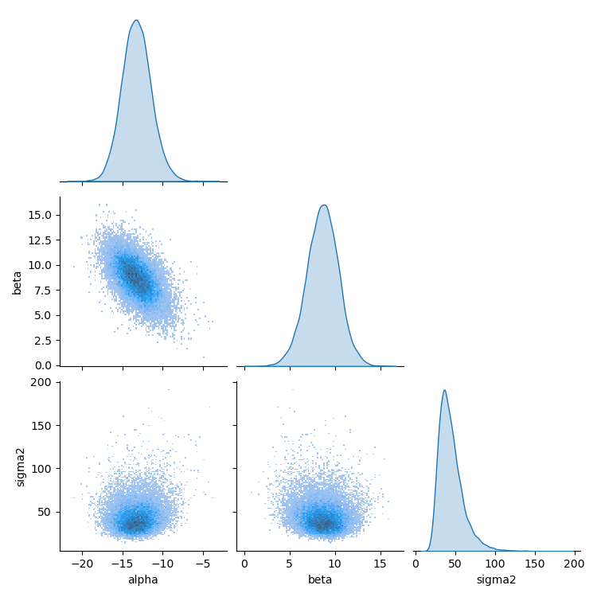
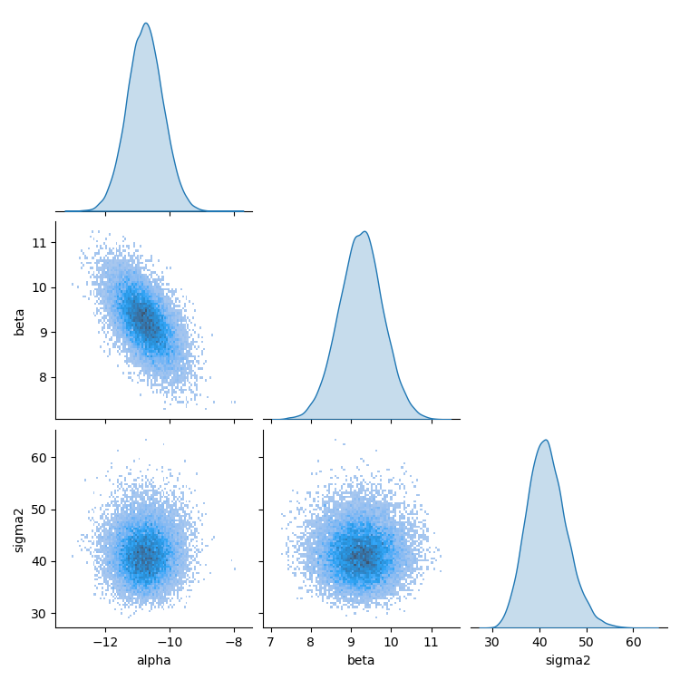
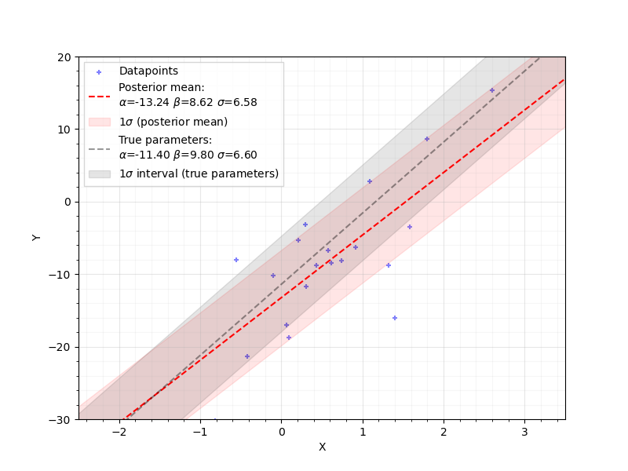
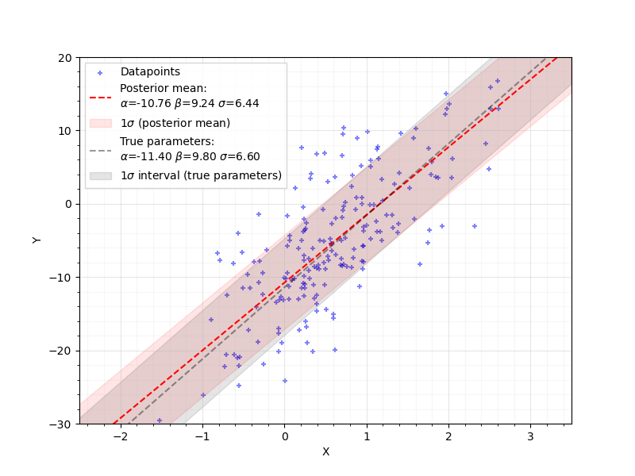

#### PROBLEM 1: TRUE-FALSE QUESTIONS
1) The solution of the stochastic integral $\int_0^T \mu \,dW_t$ is $\mu(W_t-W_0)$ and is a random variable itself
2) *The variance of a Wiener process with scale coefficient $\sigma=1$ at time $t$ is $t^2$*:    **False: the variance is $t$.**
3) The standard Drift-Diffusion Model (DDM) assumes that evidence about a dominant alternative accumulates in discrete chunks over time
**False:** in the standard DDM, evidence builds up continuously over time, not in separate chunks.
4) *The first passage time distribution has a closed-form probability density function, but its density can still be evaluated only numerically*
5) *The Euler-Maruyama method can only be used to simulate linear stochastic systems*   **False: The Euler-Maruyama method has limited error convergence (like the Euler method it's analogous to) but it should work on nonlinear stochastic systems.**
6) *For any Bayesian analysis, the prior will always have a smaller variance than the posterior*   **False: the prior should have larger variance.**
7) In addition to good statistical practices, experimental validation of cognitive models is crucial for ensuring construct validity.
8) *Markov chain Monte Carlo (MCMC) methods approximate a complex posterior distribution through a simpler, yet analytically tractable, distribution*   **False: MCMC methods approximate a complex posterior distribution by the empirical distribution of random samples from the true posterior**
9) For most Bayesian problems, the more data we collect, the less influence does the prior exert on the resulting inferences
10) The effective sample size (ESS) estimated from MCMC samplers differs from the total number of samples because the samples are not independent (i.e., exhibit non-zero autocorrelation).

#### Problem 2: DIFFUSION MODEL EXPLORATIONS

I simulated 2000 trials for each setting and changed one parameter at a time. For drift rate, I used 25 values from $0.5$ to $1.5$. The main thing I saw was that the upper-bound mean RT was always a little bigger than the lower-bound mean RT, but not by much (around $0.02$ to $0.19$ seconds). As $v$ increased, both mean RTs got smaller.

For the other parameters: bigger $a$ made RTs slower and more spread out, bigger $\beta$ made upper responses faster and lower responses slower, and bigger $\tau$ mostly just added the same amount of time to both. So overall it matched the usual DDM interpretation.

#### PROBLEM 3: PRIOR AND POSTERIOR VARIANCE

$$
\begin{align*}
\mathrm{Var}[\theta|y]&=\mathbb{E}[\theta|y]^2-\mathbb{E}[\theta^2|y]=\left( \int \theta P(\theta|y)\,d\theta \right)^2-\int \theta^2 P(\theta|y)\,d\theta\\
\mathbb{E}[\mathrm{Var}[\theta|y]]&=\int P(y) (\mathbb{E}[\theta|y]^2-\mathbb{E}[\theta^2|y])\,dy\\
&=\int P(y) \left(\int\theta P(\theta|y)d\theta\right)^2\,dy-\iint \theta^2P(y)P(\theta|y) \,d\theta\,dy\\
\\
&=\int P(y) \left(\int\theta P(\theta|y)d\theta\right)^2\,dy-\int \theta^2\left( \int P(y)P(\theta|y) \,dy \right)\,d\theta\\
&=\int P(y) \left(\int\theta P(\theta|y)d\theta\right)^2\,dy-\int \theta^2P(\theta)\,d\theta\\
&=\mathbb{E}[\mathbb{E}[\theta|y]^2]-\mathbb{E}[\theta^2]\\
\end{align*}
$$
$$
\begin{align*}
\mathbb{E}[\theta|y]&=\int \theta P(\theta|y) \, d\theta\\
\mathrm{Var}[\mathbb{E}[\theta|y]]&=\mathbb{E}[\mathbb{E}[\theta|y]]^2-\mathbb{E}[\mathbb{E}[\theta|y]^2]\\
&=\left( \int  P(y)\left( \int \theta P(\theta|y) \, d\theta \right) \,dy\right)^2-\int P(y)\left( \int \theta P(\theta|y) \, d\theta \right)^2\,dy\\
&=\left( \iint  P(y) \theta P(\theta|y) \, d\theta \,dy\right)^2-\int P(y)\left( \int \theta P(\theta|y) \, d\theta \right)^2\,dy\\
&=\left( \int\theta\left( \int  P(y) P(\theta|y) \, dy \right) \,d\theta\right)^2-\int P(y)\left( \int \theta P(\theta|y) \, d\theta \right)^2\,dy\\
&=\left( \int\theta P(\theta) \,d\theta\right)^2-\int P(y)\left( \int \theta P(\theta|y) \, d\theta \right)^2\,dy\\
\\
&=\mathbb{E}[\theta]^2-\mathbb{E}[\mathbb{E}[\theta|y]^2]
\end{align*}
$$
 

$$
\begin{align*}
\mathbb{E}[\mathrm{Var}[\theta|y]]+\mathrm{Var}[\mathbb{E}[\theta|y]]&=(\cancel{ \mathbb{E}[\mathbb{E}[\theta|y]^2] }-\mathbb{E}[\theta^2])+(\mathbb{E}[\theta]^2-\cancel{ \mathbb{E}[\mathbb{E}[\theta|y]^2] })\\
&=\mathbb{E}[\theta]^2-\mathbb{E}[\theta^2]\equiv\mathrm{Var}[\theta]\\
&\to \boxed{\mathrm{Var}[\theta]=\mathbb{E}[\mathrm{Var}[\theta|y]]+\mathrm{Var}[\mathbb{E}[\theta|y]]}
\end{align*}
$$

#### PROBLEM 4: NORMAL-NORMAL MODEL

Let's say you are (for some reason) extremely interested in how fingernails grow. You could probably find papers studying human fingernail growth rates, but you're bizarrely passionate about this subject so you want to do it yourself. Your prior is that the growth rate is roughly $4.23\pm 1.6$ mm/month, but you can't be sure, so you round up 30 people with similar heights, clip one of their index fingernails, and round them up again 1 month later to measure how much they've grown. Because you're only measuring a few millimeters of growth and it's possible the growth rate probably isn't 100% consistent, you also assign a 1.6 mm/month uncertainty to your own measurements.

I derived the posterior for normal prior and likelihood (I did this in a Desmos graph at https://www.desmos.com/calculator/u7tnirbome). The result is that, for a prior $p(\mu)\sim\mathcal{N}(\mu_0,\sigma_0)$ and a likelihood function $p(y|\mu)\sim\mathcal{N}(\mu,\sigma^2)$ is also a normal distribution:
$$P(\mu|y_i)=\mathcal{N}\left(\tilde{\mu}=\frac{\mu_0/\sigma_0^2+y_i/\sigma^2}{1/\sigma_0^2+1/\sigma^2},\tilde{\sigma}=\sqrt{1/\sigma_0^2+1/\sigma^2}\right)$$

The posterior evalutated for the full sample $y$ is $$P(\mu|y)\propto\prod_{i=1}^NP(\mu|y_i)$$
This is also a normal distribution, but it proved simpler to calculate the (log) probability density for each data point and multiply them, then normalize to get the final posterior PDF.

#### PROBLEM 5: Simple Bayesian Regression with Stan 
We wrote a Python program `generate_data.py` which produces artificial data, sampled from a linear function with Gaussian intrinsic scatter (the parameters of which are stored in `true_model_params.json`). The script then saves this to a CSV, which is read by the Jupyter notebook `run_model.ipynb` implementing a Bayesian linear regression in Stan essentially the same as we did in class. For each sample size $N$, we produce summary statistics (the main ones of note being `ESS_bulk` and `R_hat`) which are saved to CSV, and the following diagnostic plots:
- Pair plots and 1D histograms of $\alpha,\beta,\sigma^2$ as sampled from the posterior
- Trace plots for all 4 chains
- Plot of posterior mean parameters against data overlaid with true model parameters

Additionally, we run the `diagnose()` function on the fit data, which identified no serious issues for either fit.

We conducted two fits, one at N=20 and one at N=200. For both cases, the true model parameters were
$$\alpha_0=-11.4,\quad\beta_0=9.8\quad\sigma_0=6.6$$
The problem description does not specify how x-coordinates are generated. Theses were generated from a normal distribution $x\sim\mathcal{N}(\mu=0.7,\sigma=0.8)$.

For N=20 as well as N=200, the R-hat values for each paramater are close to 1, indicating good convergence, and in both cases the trace plots show good convence and the histograms show no unusual correlations between parameters. The Stan documentation suggests this statistic should always be below 1.05 for convergent data, which is promising. For the base model parameters $\alpha,\beta,\sigma^2$, the bulk ESS is around ~11000 for N=20 and around ~13000 for N=200, well above the recommended threshold of 100. The tail ESS values are roughly similar. These values are reasonably close to the

##### N=20:
|        |      Mean |   StdDev |   ESS_bulk |   ESS_tail |   R_hat |
|:-------|----------:|---------:|-----------:|-----------:|--------:|
| lp__   | -53.3941  |  1.30488 |     8605.8 |    10279.8 | 1.00008 |
| alpha  | -13.2602  |  1.80029 |    11532.2 |    11285.9 | 1.00014 |
| beta   |   8.64394 |  1.7472  |    11622.6 |    12202.6 | 1.00003 |
| sigma2 |  44.3515  | 15.822   |    11677.9 |    10802.5 | 1.0002  |
| sigma  |   6.5674  |  1.10489 |    11677.9 |    10802.5 | 1.00017 |
##### N=200:
|        |       Mean |   StdDev |   ESS_bulk |   ESS_tail |   R_hat |
|:-------|-----------:|---------:|-----------:|-----------:|--------:|
| lp__   | -478.053   | 1.23949  |    9004.21 |    10796.2 | 1.00064 |
| alpha  |  -10.7684  | 0.551588 |   12854.7  |    13762.7 | 1.00019 |
| beta   |    9.24303 | 0.547638 |   12448.2  |    13224   | 1.00026 |
| sigma2 |   41.7104  | 4.23673  |   13161.3  |    12246.2 | 1.00034 |
| sigma  |    6.45013 | 0.325891 |   13161.3  |    12246.2 | 1.00035 |

Visually, the posterior sample histograms seem reasonable for both datasets. The N=200 fit has higher precision, and the marginal $\sigma^2$ distribution is more symmetric for N=200 than N=20, which has a longer right tail.

N=20

N=200

The results are also more accurate for 200 datapoints, as the high amount of Gaussian noise in the N=20 dataset makes it hard to estimate the slope accurately.

N=20

N=200

#### PROBLEM 6: ESTIMATING THE DRIFT-DIFFUSION MODEL

The parameter that best reflects difficulty is the **drift rate** $v$, because it captures the quality and speed of evidence accumulation.`

From the estimates, **condition 1** had the lower drift rates on average, so I interpreted **condition 1 as the high-interference (more difficult) field** and Condition 2 as the low-interference / easier field.
